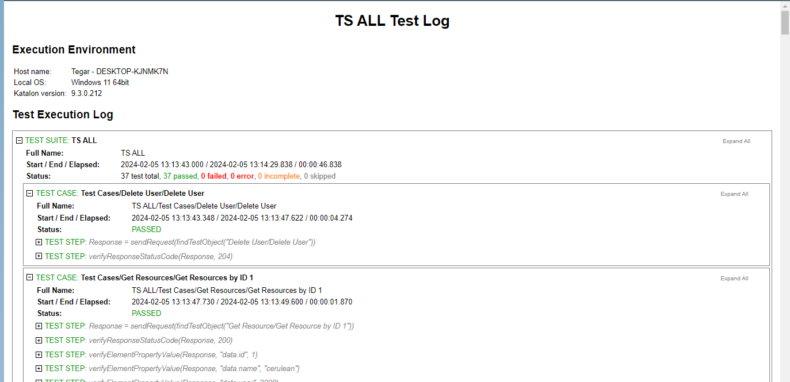

# Katalon API Testing Project

## Overview

This project tests the user management functionalities of the Reqress API using Katalon Studio. It covers the following endpoints, including both positive and negative test cases to validate expected behavior and error handling:

## Tested API Endpoints

* **Delete User:** Tests deletion of users based on valid IDs, handles error cases.
* **Get User:** Retrieves user information for valid IDs, validates returned data.
* **Get Resources:** Fetches resources associated with users, tests filtering and pagination.
* **Post User:** Creates new users with various data, verifies successful registration.
* **Put User:** Updates existing user information, handles partial updates and errors.
* **Register User:** Tests user registration flow with different credentials and validations.
* **Login User:** Authenticates users with valid credentials, handles invalid login attempts.

## Prerequisites

* Katalon Studio 9.3 or higher
* Git

## Installation and Setup

1. Clone the repository: `https://github.com/Tegar709/reqressApi-Withkatalon1.git`
2. Open the project in Katalon Studio.

## Running Tests

* Execute test suites from the Katalon Studio interface.

## Test Results

* Results are generated in the `Reports` folder.
* View detailed reports in Katalon Studio.

  
  *This screenshot illustrates the overall test results, highlighting key metrics such as pass/fail rates and any notable errors or warnings.*

